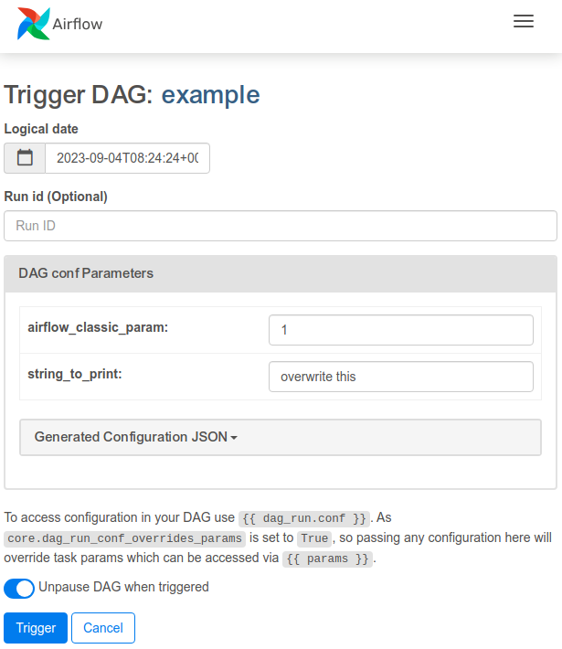

# Airflow-Pydantic-DAGs

[](https://github.com/flinz/airflow-pydantic-dags/actions/workflows/pre-publish.yml)

Airflow DAGs that receive Pydantic objects for configuration of tasks 🔋

## Why?

When writing DAGs, I like to have run configurations validated, deserialized, and
available in my tasks. While Airflow [chose to go for in-house validation](https://github.com/apache/airflow/pull/17100) and does not de-serialize the config (you get a dictionary at runtime), using Airflow-Pydantic-DAGs (APD) you get a pydantic object at runtime.

## Installation

Currently, this supports:

- airflow >= 2.6.0
- pydantic < 2

As soon as we publish this to pip :) you can

```
pip install airflow-pydantic-dags
```

## Usage

Use the class `PydanticDAG` instead of `DAG`, and pass the pydantic class you want to use
to parse the params. By decorating tasks with `@dag.parse_config()` you will get a `config_object`
passed to your task, which is an instance of the Pydantic class, initialized with your parameters.

Currently, your Pydantic class needs to:

- have default values for all attributes, otherwise the DAG will fail to initialize.
- ignore or parse [extra attributes](https://docs.pydantic.dev/latest/usage/model_config/#extra-attributes), ignore is default for Pydantic classes.

In the Airflow UI, you will find all attributes of the Pydantic class exposed as
params. Currently, only non-nested fields are exposed as single items, everything
else will become a json parameter.

## Example

Source is at [dags/example.py](dags/example.py):

```python
from airflow_pydantic_dags.dag import PydanticDAG
from airflow.decorators import task
from datetime import datetime


class MyRunConfig(pyd.BaseModel):
    string_to_print: str = "overwrite this"


with PydanticDAG(
        params_pydantic_class=MyRunConfig,
        dag_id="example",
        schedule=None,
        start_date=datetime(2023, 8, 1),
        params={"airflow_classic_param": 1},
    ) as dag:

        @task(dag=dag)
        @dag.parse_config()
        def pull_params(config_object: MyRunConfig | None = None, **kwargs):

            # params contains pydantic and non-pydantic parameter values
            print("Params:")
            print(kwargs["params"])

            # using the dag.parse_config() decorator, we also get the deserialized pydantic object as 'config_object'
            print("Pydantic object:")
            print(type(config_object))
            print(config_object)

        pull_params()
```

This generates an UI interface for your DAG, including all pydantic and non-pydantic parameters:


And the task log shows

```
{logging_mixin.py:151} INFO - Params:
{logging_mixin.py:151} INFO - {'airflow_classic_param': 1, 'string_to_print': 'overwrite this'}
{logging_mixin.py:151} INFO - Pydantic object:
{logging_mixin.py:151} INFO - <class 'unusual_prefix_95fa66c061cb15347627f327a8a577346657e3a7_example.MyRunConfig'>
{logging_mixin.py:151} INFO - string_to_print='overwrite this'
```

## Mentions

### Other projects

- [pyproject.toml](./pyproject.toml), [setup.cfg](./setup.cfg), and [.pre-commit-config.yaml](./.pre-commit-config.yaml) were adapted from the excellent [coookiecutter-django](https://github.com/cookiecutter/cookiecutter-django) project.
